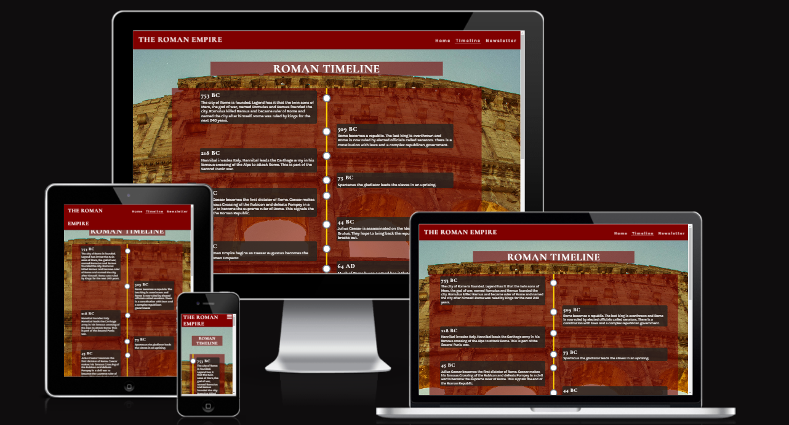
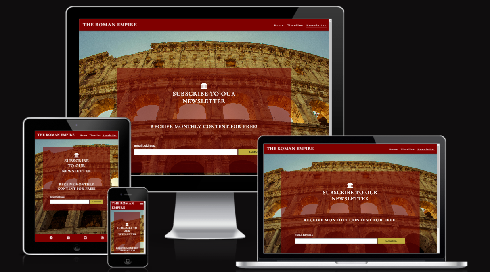

# Welcome to The Roman Empire site

Visit the deplyed side: [The Roman Empire] (https://ieuanpriede.github.io/Project-1/)

An introduction into the deep history of the Roman Empire.

Much of the world we know today took shape during the Roman era. 

## CONTENTS

* [User Experience](#user-experience-ux)
  * [User Stories](#user-stories)

* [Design](#design) 
  * [Colour Scheme](#colour-scheme)
  * [Typography](#typography)
  * [Imagery](#imagery)
  * [Wireframes](#wireframes)
  * [Features](#features)
  * [Accessibility](#accessibility)

* [Technologies Used](#technologies-used)
  * [Languages Used](#languages-used)
  * [Frameworks, Libraries & Programs Used](#frameworks-libraries--programs-used)

* [Deployment & Local Development](#deployment--local-development)
  * [Deployment](#deployment)
  * [Local Development](#local-development)

* [Testing](#testing)

* [Credits](#credits)

- - -

## User Experience

### User Stories

#### First Time Visitor Goals

* I want to be introduced to the history of the Roman Empire.
* I want digestible content as opposed to academic essays.
* I want the site to be responsive to my device.
* I want the site to be easy to navigate.

#### Returning Visitor Goals

* I want to be able to find information that I previously encountered, to refresh my memory.

#### Frequent Visitor Goals

* I want to ensure that I hold onto this new found information.
* I want to use this information to aid me with my projects/homework/studies.

## Design

### Colour Scheme

I wanted to use a darker red colour scheme to add emphasis to fact that this site is about the Roman Empire. A darker shade of red, or maroon, is synonymous with the Romans.

* In the header and footer I used #800000.
* In the main body of the page I used #491616.
* For the text I used #ffffff.
* For the background to the text I used #75030399.
* For the submit button "Subscribe" I used #ffd700.

### Typography

Google Fonts was used to import the chosen fonts for use in the site.

* For the Page Title I have used the google font [Cormorant] ('https://fonts.googleapis.com/css2?family=Cormorant:ital,wght@0,300..700;1,300..700&display=swap')
* For the Page Content I have used the google font [Karla] ('https://fonts.googleapis.com/css2?family=Karla:ital,wght@0,200..800;1,200..800&display=swap')

### Imagery

As the website is called The Roman Empire, I wanted to use an image for the page background of a Roman structure (colosseum) to give the user the feeling that they are visiting an ancient Roman site. Link: [Colusseum](https://www.pexels.com/photo/colosseum-rome-851646/).

The map of the Roman territory was taken from google images. Here is the link: [Map of Roman territory](https://upload.wikimedia.org/wikipedia/commons/thumb/f/f4/Map_of_the_Roman_Empire_at_its_height.svg/1200px-Map_of_the_Roman_Empire_at_its_height.svg.png).

The images of the Roman Soldier and the Chariot were taken from Pixabay. Here are the links: [Roman Soldier](https://cdn.pixabay.com/photo/2017/05/28/09/59/rome-2350633_960_720.jpg), [Chariot](https://cdn.pixabay.com/photo/2019/09/17/19/42/char-4484402_1280.jpg).

### Wireframes

Wireframes were created for mobile, tablet and desktop using balsamiq.

![Home Page]
![Timeline Page]
![Newsletter Page]
![Subscribe Page]

### Features

The website is comprised of a home page, a timeline page, a newsletter page & a subscribe page.

All pages are responsive and have:

* A Favicon in the browser tab.

* The title of the site at the top of every page. This title also acts as a link back to the home page.

#### The Home Page

The home page of The Roman Empire displays a hero image of a Roman colosseum, including a box with the page title inside.
Further down contains informational content about the Roman Empire, also containing images.

#### The Timeline Page

The timeline page is titled Timeline. The title and the timeline are contained within a box. The page has a background image of the colosseum seen in the home page.

#### The Newsletter Page

The Newsletter page also has a background image of the colosseum seen in the home page and timeline page. Contained within a box is the "sign-up for our newsletter section", with a text input bar to type in your email. The submit button is labelled as Subscribe. 

#### The Subscribe Page

The Subscribe page also has a background image of the colosseum seen in the home page and timeline page. Contained within a box is the "Thank you for subscribing to our newsletter" message.

### Accessibility

I have been mindful during coding to ensure that the website is as accessible friendly as possible. This has been have achieved by:

* Using semantic HTML.
* Ensuring that there is a sufficient colour contrast throughout the site.

## Technologies Used

### Languages Used

HTML, CSS

### Frameworks, Libraries & Programs Used

## Deployment & Local Development

* [Balsamiq](https://balsamiq.com/) - Used to create wireframes.
* [Github](https://github.com/) - To save and store the files for the website.
* [GitPod](https://gitpod.io/) - IDE used to create the site.
* [Google Fonts](https://fonts.google.com/) - To import the fonts used on the website.
* [Favicon.io](https://favicon.io/) To create favicon.
* [Am I Responsive?](http://ami.responsivedesign.is/) To show the website image on a range of devices.

### Deployment

The site is deployed using GitHub Pages - [The Roman Empire](https://ieuanpriede.github.io/Project-1/).

To Deploy the site using GitHub Pages:

1. Login (or signup) to Github.
2. Go to the repository for this project, [Ieuan-Priede/Project-1](https://github.com/IeuanPriede/Project-1).
3. Click the settings button.
4. Select pages in the left hand navigation menu.
5. From the source dropdown select main branch and press save.
6. The site has now been deployed, please note that this process may take a few minutes before the site goes live.

### Local Development

#### How to Fork

To fork the repository:

1. Log in (or sign up) to Github.
2. Go to the repository for this project, [Ieuan-Priede/Project-1](https://github.com/IeuanPriede/Project-1).
3. Click the Fork button in the top right corner.

#### How to Clone

To clone the repository:

1. Log in (or sign up) to GitHub.
2. Go to the repository for this project, [Ieuan-Priede/Project-1](https://github.com/IeuanPriede/Project-1).
3. Click on the code button, select whether you would like to clone with HTTPS, SSH or GitHub CLI and copy the link shown.
4. Open the terminal in your code editor and change the current working directory to the location you want to use for the cloned directory.
5. Type 'git clone' into the terminal and then paste the link you copied in step 3. Press enter.

## Testing

Please refer to [TESTING.md](TESTING.md) file for all testing carried out.

## Credits

### Code Used

* I used the Code Institute curriculum to help with my coding. In particular the 'Love Running' section. 

* I used this [video tutorial](https://www.youtube.com/watch?v=t5AE66WgQD0&t=408s&ab_channel=GreatStack) on YouTube by [GreatStack](https://www.youtube.com/@GreatStackDev) which taught me how to create a timeline.

### Content

All information on my home page were pulled from [wikipedia](https://en.wikipedia.org/wiki/Roman_Empire).

All information on the timeline page were pulled from [Duckster](https://www.ducksters.com/history/ancient_rome_timeline.php).

### Media

Home page hero image:

[Colusseum](https://www.pexels.com/photo/colosseum-rome-851646/)

Home page images : 

[Map of Roman territory](https://upload.wikimedia.org/wikipedia/commons/thumb/f/f4/Map_of_the_Roman_Empire_at_its_height.svg/1200px-Map_of_the_Roman_Empire_at_its_height.svg.png)

[Roman Soldier](https://cdn.pixabay.com/photo/2017/05/28/09/59/rome-2350633_960_720.jpg)

[Chariot](https://cdn.pixabay.com/photo/2019/09/17/19/42/char-4484402_1280.jpg)

[def]: assets/images/title.png